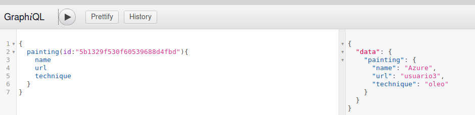
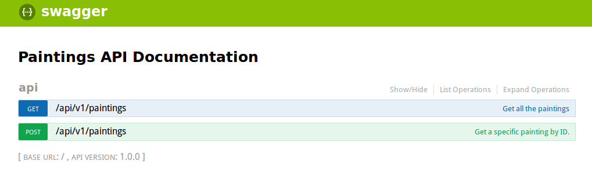

# Modern API with GraphQL & Swagger

This project was made with the porpouse to learn some topics about graphql, swagger an hapi. To read the original article, visit this [link](https://medium.com/@wesharehoodies/how-to-set-up-a-powerful-api-with-nodejs-graphql-mongodb-hapi-and-swagger-part-ii-80266790a3ac).

## Instalation
1. Install Node.js 8+
2. Install MongoDB 3.6
3. Downloand the project or type `git clone ` on your terminal.

## Usage
1. Navigate to the project folder.
2. Start the mongoDB service according to your OS.
3. Type `npm install && npm start`.
4. Visit http://localhost:4000/graphiql to see the graphic panel to realize queries.

5. Visit http://localhost:4000/documentation to see the API documentation.
